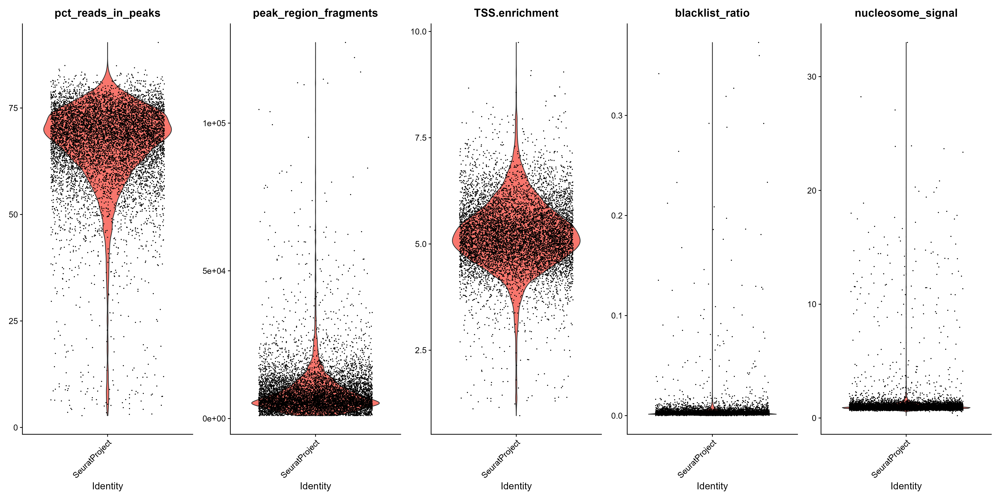

```{r setup, include=FALSE}
knitr::opts_chunk$set(echo = TRUE)
```

Analiza PBMC (peripheral blood mononuclear cells) to jedna z najczęściej wykonywanych analiz przy użyciu sekwencjonowania pojedynczej komórki. Analiza ta polega na zidentyfikowaniu i zrozumieniu różnych rodzajów komórek występujących we krwi, w tym limfocytów T, limfocytów B, monocytów, komórek NK i innych.

Analiza PBMC zwykle zaczyna się od przygotowania próbki zawierającej PBMC, którą następnie poddaje się sortowaniu i/lub rozdzielaniu na pojedyncze komórki. Następnie przeprowadza się sekwencjonowanie pojedynczej komórki, aby uzyskać dane dotyczące ekspresji genów, a także dane dotyczące otwarcia chromatyny, które mogą pomóc w identyfikacji różnych rodzajów komórek.

RNA-seq umożliwia analizę ekspresji genów na poziomie populacji komórek. Natomiast sekwencjonowanie pojedynczych komórek pozwala na identyfikację heterogeniczności populacji komórek i umożliwia badanie różnic w ekspresji genów lub dostępności chromatyny między poszczególnymi komórkami w jednej próbce.


Skupimy się na analizie scATACseq a następnie integracji danych z scRNAseq.

# Załadowanie danych i potrzebnych bibliotek 
```{r, message=FALSE, warning=FALSE}
library(rmdformats)
library(Signac)
library(Seurat)
library(GenomeInfoDb)
library(EnsDb.Hsapiens.v75)
library(ggplot2)
library(patchwork)
library(hdf5r)
set.seed(1234)

counts <- Read10X_h5(filename = "atac_v1_pbmc_10k_filtered_peak_bc_matrix.h5")  # expression matrix for 10,000 cells of one line komórkowej
metadata <- read.csv(
  file = "atac_v1_pbmc_10k_singlecell.csv",
  header = TRUE,
  row.names = 1
)

chrom_assay <- CreateChromatinAssay(
  counts = counts,
  sep = c(":", "-"),
  genome = 'hg19',
  fragments = 'atac_v1_pbmc_10k_fragments.tsv.gz',
  min.cells = 10,
  min.features = 200
)

# Creating a Seurat object
pbmc <- CreateSeuratObject(
  counts = chrom_assay,
  assay = "peaks",
  meta.data = metadata
)
```

```{r}
#counts
```


```{r}
#pbmc[[]]
```


Kod odczytuje nieprzetworzone dane zliczeń za pomocą Read10X_h5funkcji z pakietu Seurat. 

Plik metadanych zawiera informacje o poszczególnych komórkach w eksperymencie, takie jak ich identyfikator próbki, warunki eksperymentu i metryki sekwencjonowania.

CreateChromatinAssay - Funkcja ta ułatwia analizę danych ATAC-seq poprzez uproszczenie procesu integracji danych genetycznych i epigenetycznych, a także umożliwia integrację z danymi z innych typów eksperymentów epigenetycznych.\

- Argument genome określa wersję genomu, która jest używana do mapowania regionów genomowych i dostępności chromatyny.
- Argument fragments odnosi się do pliku zawierającego informacje o fragmentach genomowych, które zostały użyte w badaniu. Ten plik zawiera informacje o długości i położeniu fragmentów genomowych.
- Argumenty min.cells i min.features określają minimalną liczbę komórek i cech, które muszą zostać spełnione, aby region genomowy został uwzględniony w analizie.

W rezultacie, CreateChromatinAssay tworzy obiekt assay, który zawiera informacje o dostępności chromatyny w każdej komórce dla każdego regionu genomowego, a także informacje o długości fragmentów genomowych.
```{r}
pbmc
```

assay "peaks" zawiera informacje o dostępności chromatyny w różnych regionach genomowych, które zostały wykryte w danych ATAC-seq.
Poniższy kod umożliwia uzyskanie dostępu do tych danych w formie macierzy,
```{r}
pbmc[['peaks']]
```
```{r, message=FALSE, warning=FALSE}
granges(pbmc)
```
Funkcja granges(pbmc) jest funkcją Seurat, która zwraca obiekt GRanges reprezentujący położenie cech chromatynowych (peaks) w genomie.


Możemy również dodać adnotacje genów do pbmcobiektu dla ludzkiego genomu. Umożliwi to funkcjom podrzędnym pobieranie informacji o adnotacjach genów bezpośrednio z obiektu.

```{r, message=FALSE, warning=FALSE}
# extract gene annotations from EnsDb
annotations <- GetGRangesFromEnsDb(ensdb = EnsDb.Hsapiens.v75)

# change to UCSC style since the data was mapped to hg19
seqlevelsStyle(annotations) <- 'UCSC'

# add the gene information to the object
Annotation(pbmc) <- annotations
```
Kod rozpoczyna się od pobrania informacji o genach dla gatunku ludzkiego (Homo sapiens) z bazy danych EnsDb.Hsapiens.v75. Następnie funkcja seqlevelsStyle zmienia styl numerowania sekwencji w obiekcie annotations na styl używany przez UCSC Genome Browser dla genomu ludzkiego (hg19).

Ostatnia linia kodu dodaje informacje o genach do obiektu pbmc przy użyciu funkcji Annotation, dzięki czemu możliwe jest przypisanie identyfikatorów genów do poszczególnych komórek w obiekcie pbmc.

```{r}
#annotations
```

# Obliczanie metryk QC

Wskaźniki do oceny jakości danych:

- Wzór prążków nukleosomów: Histogram wielkości fragmentów DNA (określony na podstawie odczytów sekwencjonowania par końców) powinien wykazywać silny wzór prążków nukleosomu odpowiadający długości DNA owiniętego wokół pojedynczego nukleosomu. Obliczamy to na pojedynczą komórkę i określamy ilościowo przybliżony stosunek fragmentów mononukleosomalnych do fragmentów wolnych od nukleosomów (przechowywane jako nucleosome_signal)

- Słabe eksperymenty ATAC-seq zazwyczaj będą miały niski wynik wzbogacenia TSS. Możemy obliczyć tę metrykę dla każdej komórki za pomocą TSSEnrichment()funkcji, a wyniki są przechowywane w metadanych pod nazwą kolumny TSS.enrichment.

- Komórki z bardzo małą liczbą odczytów mogą wymagać wykluczenia ze względu na małą głębokość sekwencjonowania. Komórki o bardzo wysokim poziomie mogą reprezentować dublety, skupiska jąder lub inne artefakty.


- Frakcja fragmentów w pikach: Reprezentuje frakcję wszystkich fragmentów, które mieszczą się w pikach ATAC-seq. Komórki o niskich wartościach (tj. <15-20%) często reprezentują komórki niskiej jakości lub artefakty techniczne, które należy usunąć.

- Odczyty proporcji w regionach czarnej listy genomowej Projekt ENCODE dostarczył listę regionów czarnej listy reprezentujących odczyty, które często są związane z sygnałem artefaktów. Komórki z dużym odsetkiem odczytów mapowanych na te obszary (w porównaniu z odczytami mapowanymi na piki) często stanowią artefakty techniczne i powinny zostać usunięte.


```{r}
# compute nucleosome signal score per cell
pbmc <- NucleosomeSignal(object = pbmc)          #nucleosome fragments / nucleosome free fragments

# compute TSS enrichment score per cell
pbmc <- TSSEnrichment(object = pbmc, fast = FALSE)

# add blacklist ratio and fraction of reads in peaks
pbmc$pct_reads_in_peaks <- pbmc$peak_region_fragments / pbmc$passed_filters * 100
pbmc$blacklist_ratio <- pbmc$blacklist_region_fragments / pbmc$peak_region_fragments
```

Funkcja NucleosomeSignal oblicza sygnał nukleosomowy, który odzwierciedla kondensację chromatyny i organizację DNA wokół nukleosomów. Wyższy sygnał nukleosomowy może wskazywać na bardziej zwartą chromatynę, co może utrudnić dostępność czynników transkrypcyjnych do sekwencji regulatorowych.

Funkcja TSSEnrichment oblicza wzbogacenie w pobliżu miejsca startu transkrypcji (TSS) każdego genu, które odzwierciedla aktywność promoterów i wzmacniaczy. Wyższe wzbogacenie TSS może wskazywać na bardziej aktywne geny.

Obliczono również stosunek sygnału w czarnych listach do sygnału w peak_region_fragments (regionach szczytowych) i procent odczytów znajdujących się w regionach szczytowych, co pomaga w ocenie jakości danych sekwencjonowania.

Sekwencje szczytowe to krótkie, 100-1000 par zasad sekwencje DNA, które są wzbogacone w danej próbce w porównaniu z genomem referencyjnym. Sekwencje szczytowe pochodzą z regionów, w których czynniki transkrypcyjne, białka regulatorowe i inne czynniki epigenetyczne wiążą się z chromatyną i regulują transkrypcję genów.


```{r}
pbmc$high.tss <- ifelse(pbmc$TSS.enrichment > 2, 'High', 'Low')
TSSPlot(pbmc, group.by = 'high.tss') + NoLegend()
```

Następnie funkcja TSSPlot() rysuje wykres, który przedstawia rozkład bogactwa sekwencji w pobliżu TSS dla komórek, podzielonych na dwie grupy na podstawie wartości kolumny "high.tss". 


```{r}
pbmc$nucleosome_group <- ifelse(pbmc$nucleosome_signal > 4, 'NS > 4', 'NS < 4')
FragmentHistogram(object = pbmc, group.by = 'nucleosome_group')
```

Możemy również spojrzeć na okresowość długości fragmentów dla wszystkich komórek i pogrupować według komórek o wysokiej lub niskiej sile sygnału nukleosomalnego.

Stosunek fragmentów ciętych mononukleosomów do fragmentów wolnych od nukleosomów można nazwać sygnałem nukleosomu.

Możesz zobaczyć, że komórki, których NS > 4 mają różne wzorce prążków nukleosomów. Pozostałe komórki wykazują wzór typowy dla udanego eksperymentu ATAC-seq.


```{r}
Vlnplot_image <- VlnPlot(
  object = pbmc,
  features = c('pct_reads_in_peaks', 'peak_region_fragments',
               'TSS.enrichment', 'blacklist_ratio', 'nucleosome_signal'),
  pt.size = 0.1,
  ncol = 5
)

ggsave("Vlnplot_image.png", plot = Vlnplot_image, width = 20, height = 10)
```

{#id .class width=90% height=90%}\


Powstały wykres przedstawia rozkład cech we wszystkich komórkach obiektu pbmc. 


Na koniec usuwamy komórki, które są wartościami odstającymi dla tych metryk QC.


```{r}
pbmc <- subset(
  x = pbmc,
  subset = peak_region_fragments > 3000 &
    peak_region_fragments < 20000 &
    pct_reads_in_peaks > 15 &
    blacklist_ratio < 0.05 &
    nucleosome_signal < 4 &
    TSS.enrichment > 2
)
pbmc
```
# Normalizacja i liniowa redukcja wymiarów

Normalizacja: Signac przeprowadza normalizację częstotliwości dokumentu z odwrotną częstotliwością (TF-IDF). Jest to dwuetapowa procedura normalizacji, która zarówno normalizuje w komórkach, aby skorygować różnice w głębokości sekwencjonowania komórkowego, jak i między pikami, aby nadać wyższe wartości rzadszym pikom.

Wybór cech: Niski zakres dynamiczny danych scATAC-seq sprawia, że wybór zmiennych cech jest trudny. Zamiast tego możemy użyć tylko n % górnych cech (szczytów) do redukcji wymiarów lub usunąć funkcje obecne w mniej niż n komórkach za pomocą FindTopFeatures()funkcji.

Redukcja wymiarów: Następnie przeprowadzamy dekompozycję wartości osobliwych (SVD) na macierzy TD-IDF, używając cech (peaks) wybranych powyżej. Zwraca to zredukowaną reprezentację wymiarową obiektu, analogicznie jak w PCA.

```{r}
pbmc <- RunTFIDF(pbmc)
pbmc <- FindTopFeatures(pbmc, min.cutoff = 'q0')
pbmc <- RunSVD(pbmc)
```
Połączone etapy TF-IDF, po których następuje SVD, są znane jako LSI (Latent Semantic Indexing)

q0 - cechy, które mają wartość powyżej 0 percentyla, zostaną wybrane do dalszej analizy.


```{r}
DepthCor(pbmc)
```

Tutaj widzimy, że istnieje bardzo silna korelacja między pierwszym składnikiem LSI a całkowitą liczbą zliczeń dla komórki, więc wykonamy dalsze kroki bez tego składnika.

# Redukcja i grupowanie wymiarów nieliniowych
```{r}
pbmc <- RunUMAP(object = pbmc, reduction = 'lsi', dims = 2:30)       #without 1
pbmc <- FindNeighbors(object = pbmc, reduction = 'lsi', dims = 2:30)
pbmc <- FindClusters(object = pbmc, verbose = FALSE, algorithm = 3)
DimPlot(object = pbmc, label = TRUE) + NoLegend()
```
Funkcja "FindNeighbors" znajduje sąsiednie punkty w przestrzeni wielowymiarowej, które są następnie wykorzystywane w funkcji "FindClusters", aby znaleźć klastry lub grupy komórek o podobnej ekspresji genów.


# Macierz aktywności genów
Wizualizacja UMAP ujawnia obecność wielu grup komórek w ludzkiej krwi. Jeśli jesteś zaznajomiony z naszymi analizami scRNA-seq PBMC , możesz nawet rozpoznać obecność pewnych populacji mieloidalnych i limfoidalnych w danych scATAC-seq. Jednak opisywanie i interpretacja klastrów jest trudniejsza w danych scATAC-seq, ponieważ znacznie mniej wiadomo o rolach funkcjonalnych niekodujących regionów genomowych niż o regionach kodujących białka (genach).

Możemy jednak spróbować określić ilościowo aktywność każdego genu w genomie, oceniając dostępność chromatyny związaną z każdym genem i stworzyć nowy test aktywności genu wywodzący się z danych scATAC-seq.

Aby stworzyć macierz aktywności genów, wyodrębniamy współrzędne genów i rozszerzamy je tak, aby obejmowały region powyżej 2 kb (ponieważ dostępność promotora jest często skorelowana z ekspresją genów). Następnie liczymy liczbę fragmentów dla każdej komórki, które są mapowane na każdy z tych regionów, używając funkcji using FeatureMatrix(). Te kroki są automatycznie wykonywane przez funkcję GeneActivity()

```{r}
gene.activities <- GeneActivity(pbmc)
```
```{r}
# add the gene activity matrix to the Seurat object as a new assay and normalize it
pbmc[['RNA']] <- CreateAssayObject(counts = gene.activities)
pbmc <- NormalizeData(
  object = pbmc,
  assay = 'RNA',
  normalization.method = 'LogNormalize',
  scale.factor = median(pbmc$nCount_RNA)
)
```

Teraz możemy zwizualizować działanie genów markerowych charakterystycznych dla danych typów komórek, aby pomóc w interpretacji naszych klastrów ATAC-seq.

```{r}
DefaultAssay(pbmc) <- 'RNA'

FeaturePlot(
  object = pbmc,
  features = c('MS4A1', 'CD3D', 'LEF1', 'NKG7', 'TREM1', 'LYZ'),
  pt.size = 0.1,
  max.cutoff = 'q95',
  ncol = 3
)
```


- 'MS4A1' jest kodowany przez gen CD20 i służy jako marker powierzchniowy dla limfocytów B, w tym dla komórek prekursorowych i dojrzałych.
- 'CD3D' jest kodowany przez gen kompleksu receptora komórkowego CD3, który jest związany z komórkami T i jest istotnym markerem powierzchniowym dla limfocytów T.
- 'LEF1' to gen związany z białkiem LEF1, który pełni rolę w regulacji ekspresji genów i jest markerem dla komórek progenitorowych dla różnych typów komórek układu krwiotwórczego, w tym dla komórek progenitorowych dla limfocytów T.
- 'NKG7' jest kodowany przez gen naturalnej cytotoksycznej receptora NK (NKG2D) i jest markerem dla komórek NK (natural killer) i niektórych komórek T.
- 'TREM1' jest kodowany przez gen białka powierzchniowego, który jest obecny w monocytach i makrofagach, ale także w innych typach komórek, takich jak neutrofile i komórki dendrytyczne.
- 'LYZ' to gen kodujący lizozym, enzym o właściwościach bakteriobójczych, który jest obecny w różnych typach komórek, w tym w granulocytach, monocytach i komórkach nabłonka.


# Integracja z danymi scRNA-seq
Tutaj ładujemy wstępnie przetworzony zestaw danych scRNA-seq dla ludzkich PBMC, również dostarczony przez 10x Genomics.

Naszym celem jest zidentyfikowanie wspólnych wzorców korelacji w macierzy aktywności genów i zbiorze danych scRNA-seq, aby zidentyfikować dopasowane stany biologiczne w dwóch modalnościach. Ta procedura zwraca wynik klasyfikacji dla każdej komórki dla każdej etykiety klastra zdefiniowanej przez scRNA-seq.

```{r}
# Load the pre-processed scRNA-seq data for PBMCs
pbmc_rna <- readRDS("./pbmc_10k_v3.rds")

transfer.anchors <- FindTransferAnchors(
  reference = pbmc_rna,
  query = pbmc,
  reduction = 'cca'
)

predicted.labels <- TransferData(
  anchorset = transfer.anchors,
  refdata = pbmc_rna$celltype,
  weight.reduction = pbmc[['lsi']],
  dims = 2:30
)

pbmc <- AddMetaData(object = pbmc, metadata = predicted.labels)
```


```{r}
plot1 <- DimPlot(
  object = pbmc_rna,
  group.by = 'celltype',
  label = TRUE,
  repel = TRUE) + NoLegend() + ggtitle('scRNA-seq')

plot2 <- DimPlot(
  object = pbmc,
  group.by = 'predicted.id',
  label = TRUE,
  repel = TRUE) + NoLegend() + ggtitle('scATAC-seq')

plot1 + plot2
```
Widać, że klasyfikacje oparte na scRNA są całkowicie zgodne z wizualizacją UMAP, obliczoną tylko na podstawie danych scATAC-seq. Możemy teraz łatwo dodawać adnotacje do naszych klastrów pochodzących z scATAC-seq (alternatywnie moglibyśmy użyć samych klasyfikacji RNA). Zauważamy, że klaster 14 mapuje komórki T pamięci CD4, ale jest to bardzo mały klaster z niższymi wskaźnikami QC. Ponieważ ta grupa prawdopodobnie reprezentuje komórki niskiej jakości, usuwamy ją z dalszej analizy.


```{r}
pbmc <- subset(pbmc, idents = 14, invert = TRUE)
pbmc <- RenameIdents(
  object = pbmc,
  '0' = 'CD14 Mono',
  '1' = 'CD4 Memory',
  '2' = 'CD8 Effector',
  '3' = 'CD4 Naive',
  '4' = 'CD14 Mono',
  '5' = 'DN T',
  '6' = 'CD8 Naive',
  '7' = 'NK CD56Dim',
  '8' = 'pre-B',
  '9' = 'CD16 Mono',
  '10' = 'pro-B',
  '11' = 'DC',
  '12' = 'NK CD56bright',
  '13' = 'pDC'
)
```

# Znajdź różnie dostępne piki między klastrami

Aby znaleźć różnie dostępne regiony między klastrami komórek, możemy przeprowadzić test dostępności różnicowej (Differential accessibility" (DA)).
Tutaj skupimy się na porównaniu naiwnych komórek CD4 i monocytów CD14, ale przy użyciu tych metod można porównać dowolne grupy komórek.

```{r}
# change back to working with peaks instead of gene activities
DefaultAssay(pbmc) <- 'peaks'

da_peaks <- FindMarkers(
  object = pbmc,
  ident.1 = "CD4 Naive",
  ident.2 = "CD14 Mono",
  test.use = 'LR',
  latent.vars = 'peak_region_fragments'
)

head(da_peaks)
```
```{r}
plot1 <- VlnPlot(
  object = pbmc,
  features = rownames(da_peaks)[1],
  pt.size = 0.1,
  idents = c("CD4 Naive","CD14 Mono")
)
plot2 <- FeaturePlot(
  object = pbmc,
  features = rownames(da_peaks)[1],
  pt.size = 0.1
)

plot1 | plot2
```

Innym sposobem znalezienia regionów DA między dwiema grupami komórek jest przyjrzenie się dostępności zmiany krotności między dwiema grupami komórek. Może to być znacznie szybsze niż przeprowadzanie bardziej wyrafinowanych testów DA, ale nie jest w stanie uwzględnić ukrytych zmiennych, takich jak różnice w całkowitej głębokości sekwencjonowania między komórkami, i nie wykonuje żadnego testu statystycznego. Jednak nadal może to być przydatny sposób szybkiego eksplorowania danych i można go wykonać za pomocą funkcji FoldChange()w Seurat.

```{r}
fc <- FoldChange(pbmc, ident.1 = "CD4 Naive", ident.2 = "CD14 Mono")
head(fc)
```

Argument "ident.1" odnosi się do pierwszej populacji komórek (CD4 Naive), a argument "ident.2" odnosi się do drugiej populacji komórek (CD14 Mono) i pokazują procent komórek ekspresujących dany gen.


"avg_log2FC" to wartość średniej logarytmicznej zmiany dwukrotnej pomiędzy dwoma populacjami komórek. Jest to miara różnicy w poziomach ekspresji genów między populacjami, gdzie wartości większe niż zero oznaczają zwiększenie ekspresji genów w jednej populacji w porównaniu do drugiej, a wartości mniejsze niż zero oznaczają zmniejszenie ekspresji genów.

Ponieważ wartości ekspresji genów są zazwyczaj bardzo zmienne, wykorzystuje się logarytmiczne przekształcenie danych, aby uzyskać wartości bardziej stabilne i łatwiejsze do interpretacji.

Jeśli przejrzysz listy genów, zobaczysz, że piki otwarte w naiwnych limfocytach T są zbliżone do genów takich jak BCL11B i GATA3 (kluczowe regulatory różnicowania limfocytów T), podczas gdy piki otwarte w monocytach są zbliżone do genów takich jak CEBPB (kluczowy regulator różnicowania monocytów).


Podział danych na zestaw regionów, w którym  dostępność chromatyny jest znacznie wyższa w populacji limfocytów T naiwnych CD4 w porównaniu z populacją monocytów CD14 (avg_log2FCwiększej niż 3) oraz zestaw regionów, w których dostępność chromatyny jest znacznie wyższa w populacji monocytów CD14 w porównaniu z populacją komórek T naiwnych CD4.

Funkcja ClosestFeature()jest następnie wykorzystywana do znalezienia najbliższego genu dla każdego z tych regionów, w oparciu o odległość genomową między regionem a miejscem startu transkrypcji (TSS) pobliskich genów.

```{r}
open_cd4naive <- rownames(da_peaks[da_peaks$avg_log2FC > 3, ])
open_cd14mono <- rownames(da_peaks[da_peaks$avg_log2FC < -3, ])

closest_genes_cd4naive <- ClosestFeature(pbmc, regions = open_cd4naive)
closest_genes_cd14mono <- ClosestFeature(pbmc, regions = open_cd14mono)
```


```{r}
head(closest_genes_cd4naive)
```


```{r}
head(closest_genes_cd14mono)
```

# Wykreślanie regionów genomowych

Możemy wykreślić częstotliwość integracji Tn5 w regionach genomu dla komórek pogrupowanych według klastra, typu komórki lub innych metadanych przechowywanych w obiekcie dla dowolnego regionu genomowego za pomocą tej funkcji CoveragePlot(). Reprezentują one pseudo-masowe ścieżki dostępności, w których sygnał ze wszystkich komórek w grupie został uśredniony razem, aby zwizualizować dostępność DNA w regionie.


```{r}
# set plotting order
levels(pbmc) <- c("CD4 Naive","CD4 Memory","CD8 Naive","CD8 Effector","DN T","NK CD56bright","NK CD56Dim","pre-B",'pro-B',"pDC","DC","CD14 Mono",'CD16 Mono')

CoveragePlot(
  object = pbmc,
  region = rownames(da_peaks)[1],
  extend.upstream = 40000,
  extend.downstream = 20000
)
```

CoveragePlot()generuje wykres przedstawiający profil dostępności chromatyny interesującego regionu we wszystkich komórkach obiektu Seurat. Powstały wykres może pomóc w wizualizacji różnic w dostępności chromatyny między różnymi typami komórek lub stanami i może zapewnić wgląd w potencjalne mechanizmy regulacyjne zaangażowane w kontrolowanie ekspresji genów w tych komórkach.